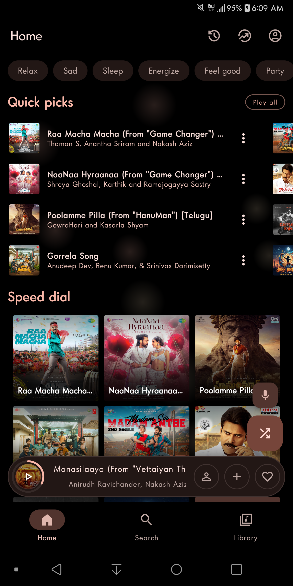
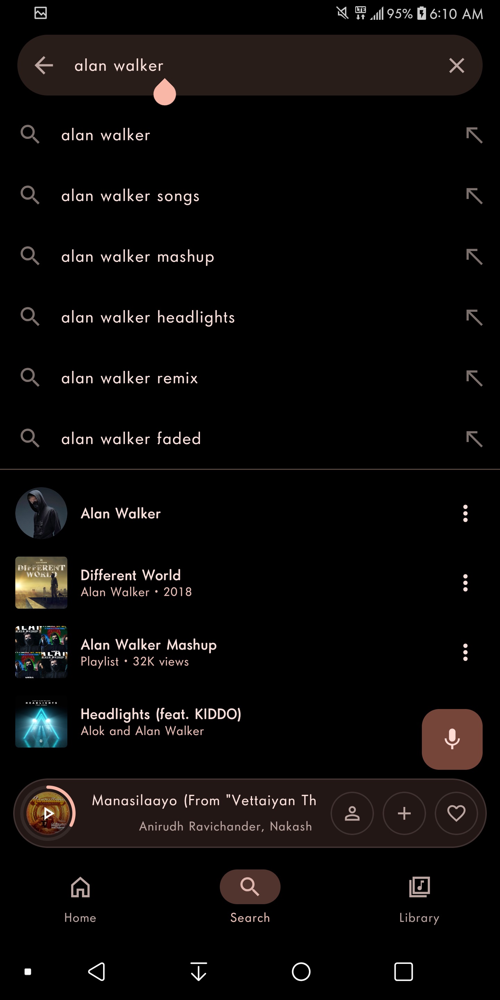
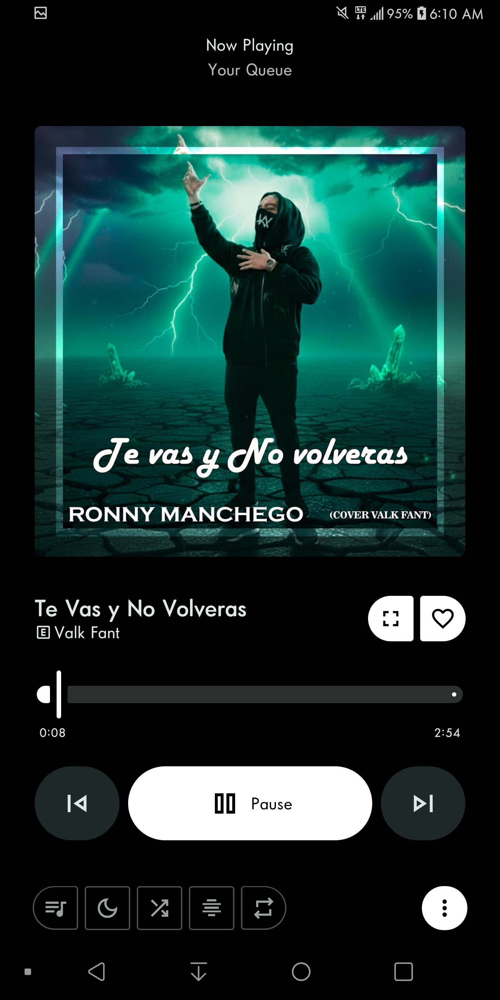

  

# 🎵 Lovely Beats

### Feel The Music, Love The Beats ❤️

Fast • Lightweight • Modern • High Quality Audio

---

# ✨ Features

- 🎵 Unlimited Music Streaming
- 📥 Fast Music Downloads
- 💾 Downloads Automatically Saved
- ⚡ Fast & Lightweight
- 🎧 High Quality Audio
- 🌙 Beautiful Dark Theme
- ❤️ Favorite Songs
- 📂 Library Management
- 🔍 Smart Search
- ▶️ Powerful Music Player
- 📶 Optimized for YouTube Mobile Package
- 🚀 Better Performance
- 🛠 Regular Updates

---

# 📱 Screenshots

## 🏠 Home

---

## 🔍 Search

---

## 🎵 Player

---

# 📥 Installation

1. Download the latest APK.
2. Enable **Install Unknown Apps**.
3. Install the application.
4. Open **Lovely Beats**.
5. Enjoy your music ❤️

---

# 📦 Requirements

- Android 5.0+
- Storage Permission
- Internet Connection
- YouTube Mobile Package (Recommended)

---

# 🚀 Latest Release

Download the newest version from:

### 👉 https://github.com/lovelyofficial/Lovely-Beats/releases/latest

---

# ❤️ Support

Need help?

Open a GitHub Issue or contact us.

---

# 📜 Project Information

| Item | Value |
|------|-------|
| App Name | Lovely Beats |
| Platform | Android |
| Language | Java |
| Version | v1.0.0 |
| License | All Rights Reserved |

---

# ⭐ Support This Project

If you like **Lovely Beats**, don't forget to

⭐ Star this repository

❤️ Share with your friends

🚀 Download the latest release

---

## 🎵 Lovely Beats

### Feel The Music, Love The Beats ❤️

Made with ❤️ by **Lovely Official**

