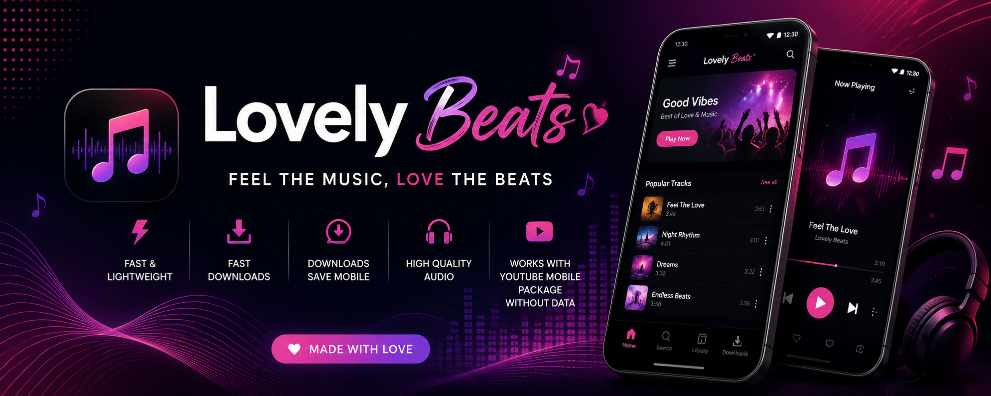

  

# 🎵 Lovely Beats

### Feel The Music, Love The Beats ❤️

Fast • Lightweight • Modern • High Quality Audio

---

## ✨ Features

- 🎵 Music Streaming
- 📥 Fast Music Downloads
- 💾 Auto Save Downloads
- 🎧 High Quality Audio
- ⚡ Fast & Lightweight
- 🌙 Modern Dark UI
- ❤️ Favorites
- 🔍 Smart Search
- ▶️ Beautiful Music Player
- 📶 Optimized for YouTube Mobile Package
- 🚀 Better Performance

---

## 📱 Screenshots

---

## 📦 Requirements

- Android 5.0+
- Storage Permission
- Internet Connection
- YouTube Mobile Package (Recommended)

---

## 📥 Download

Download the latest version from the **Releases** section.

➡️ https://github.com/lovelyofficial/Lovely-Beats/releases/latest

---

## ❤️ Support

If you find a bug or have a suggestion, please open a GitHub Issue.

---

## 📄 License

See the LICENSE file for more information.

---

### ⭐ If you like Lovely Beats, please Star this repository!

Made with ❤️ by **Lovely Official**

